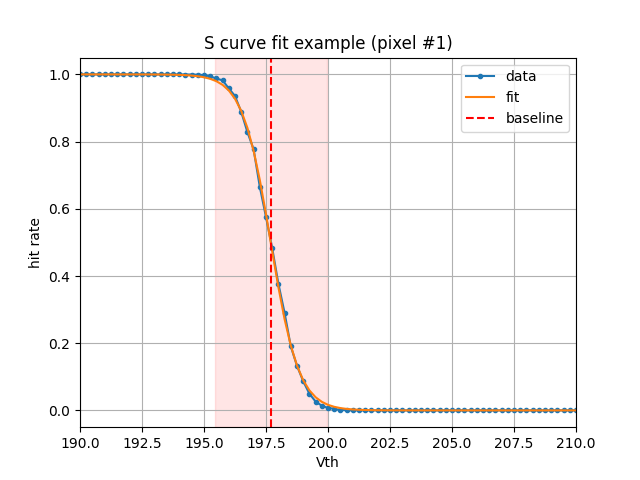

# Software for basic ETL RB, PB and module (system) tests: Tamalero

```
 ████████╗ █████╗ ███╗   ███╗ █████╗ ██╗     ███████╗███████╗
 ╚══██╔══╝██╔══██╗████╗ ████║██╔══██╗██║     ██╔════╝██╔════╝
    ██║   ███████║██╔████╔██║███████║██║     █████╗  ███████╗
    ██║   ██╔══██║██║╚██╔╝██║██╔══██║██║     ██╔══╝  ╚════██║
    ██║   ██║  ██║██║ ╚═╝ ██║██║  ██║███████╗███████╗███████║
    ╚═╝   ╚═╝  ╚═╝╚═╝     ╚═╝╚═╝  ╚═╝╚══════╝╚══════╝╚══════╝
```

## Software structure

```
── Control Board (KCU105)
   ├── Readout Board 0
   │   ├── LPGBT
   │   ├── SCA
   │   ├── Power Board Interface
   │   ├── Module 0
   │   │   ├── ETROC0
   │   │   ├── ETROC1
   │   │   ├── ETROC2
   │   │   └── ETROC3
   │   ├── Module 1
   │   ├── ...
   │   └── Module N
   ├── Readout Board 1
   ├── Readout Board 2
   ├── ...
   └── Readout Board 9
```


## Dependencies

Tested on python 3.8.10.
Install the software with all its dependencies except IPbus:

``` shell
git clone https://gitlab.cern.ch/cms-etl-electronics/module_test_sw.git
pip install --editable .
```

To install IPbus please see the [IPbus user guide](https://ipbus.web.cern.ch/doc/user/html/software/installation.html).

The software emulator also runs without ipbus installed.
To use a container with preinstalled dependencies, refer to [this section](https://gitlab.cern.ch/cms-etl-electronics/module_test_sw#using-docker) (needs docker installed).

## Running the code

To properly set all paths run `source setup.sh`.

### Software only

A software emulator of ETROC2 has been implemented, and examples of its usage are implemented in `test_ETROC.py`.
The simplest example requests a handful of data words by sending L1As at different threshold values.

``` bash
ipython3 -i test_ETROC.py
```

Which should return something like

``` bash
Running without uhal (ipbus not installed with correct python bindings)
Sending 10 L1As and reading back data, for the following thresholds:
[203.0, 202.7, 202.4, 202.1, 201.8, 201.5, 201.2, 200.9, 200.6, 200.3]
Threshold at th=203.0mV
Vth set to 203.000000.
('header', {'elink': 0, 'sof': 0, 'eof': 0, 'full': 0, 'any_full': 0, 'global_full': 0, 'l1counter': 1, 'type': 0, 'bcid': 0})
('trailer', {'elink': 0, 'sof': 0, 'eof': 0, 'full': 0, 'any_full': 0, 'global_full': 0, 'chipid': 25152, 'status': 0, 'hits': 0, 'crc': 0})
Threshold at th=202.7mV
Vth set to 202.700000.
('header', {'elink': 0, 'sof': 0, 'eof': 0, 'full': 0, 'any_full': 0, 'global_full': 0, 'l1counter': 2, 'type': 0, 'bcid': 0})
('trailer', {'elink': 0, 'sof': 0, 'eof': 0, 'full': 0, 'any_full': 0, 'global_full': 0, 'chipid': 25152, 'status': 0, 'hits': 0, 'crc': 0})
Threshold at th=202.4mV
...
```

A threshold scan can be run with

``` bash
ipython3 -i test_ETROC.py -- --vth --fitplots
```

The threshold scans will produce S-curves for each pixel.


### With a physical Readout Board

A minimal example of usage of this package with a physical readout board (v1, v2 or v3) is given in `test_tamalero.py`, which can be run as:
`ipython3 -i test_tamalero.py -- --kcu 192.168.0.10`

The code is organized similar to the physical objects.

You can easily interact with all frontend and backend components using interactive python (ipython is recommended). Start an ipython session, e.g. `ipython3` and follow the instructions below.

To interact with the ETL front end (Readout Board and ETROC) we need to initialize a control board (KCU105) at its correct IP address (192.168.0.10 in this example, the default IP address of KCU boards in our setup):
```python
from tamalero.utils import get_kcu

kcu = get_kcu(
                "192.168.0.10",
                control_hub = True,
                host = 'localhost',
                verbose = False,
            )
```
This function will automatically download the appropriate version of the address table of the KCU Firmware.
You can poll the status of the KCU by using `kcu.status()`.

**Note:** Control hub is now required for using the KCU, as shown in the default `ipb_path` of the KCU (i.e. `"chtcp-2.0://localhost:10203?target=192.168.0.11:50001"` instead of `"ipbusudp-2.0://192.168.0.11:50001"`). `tamalero` won't run otherwise.
Control hub is part of the IPbus package and can be started with e.g. `/opt/cactus/bin/controlhub_start`.

You can then instantiate a readout board. The default number is "0" if the RB is connected through the SFP optical transceiver module. For connections through the KCU Firefly Mezzanine board, please refer to documentation [here](docs/multi_rb.md).
The configuration corresponds to what is connected to the RB: nothing connected ("default"), module v0/v0b/v1 ("modulev0"/"modulev0b"/"modulev1") or emulator ("emulator").
``` python
from tamalero.ReadoutBoard import ReadoutBoard
rb = ReadoutBoard(
                    0,
                    kcu = kcu,
                    config = "modulev1",
                )
```

Now we're all set to use the readout board!
One can interact with the lpGBT and SCA directly, either via `rb.DAQ_LPGBT` or `rb.SCA`.
The classes are defined in [here](https://gitlab.cern.ch/cms-etl-electronics/module_test_sw/-/tree/master/tamalero).

Some high level functions are implemented to simplify configuration and monitoring.
An example is the following:
```
rb.read_temp(verbose=1)
```
that reads the temperature of all the available sensors on the board. The output looks like this
```
Temperature on RB RT1 is: 28.8 C
Temperature on RB RT2 is: 32.0 C
Temperature on RB SCA is: 30.1 C
Temperature on RB VTRX is: 29.0 C
```


The current reading of the SCA ADCs can be obtained with
```
rb.SCA.read_adcs()
```
which reads all ADC lines that are connected, according to the mapping given in [configs/SCA_mapping.yaml](https://gitlab.cern.ch/cms-etl-electronics/module_test_sw/-/blob/master/configs/SCA_mapping.yaml) or [configs/SCA_mapping_v2.yaml](https://gitlab.cern.ch/cms-etl-electronics/module_test_sw/-/blob/master/configs/SCA_mapping_v2.yaml) depending on the readout board version.
An example is given here:
```
adc:
    1V2_mon0:
        pin: 0x01
        conv: 1
        flavor: small
        comment: monitoring for 1.2V of ETROC0

    ...

        BV0:
        pin: 0x12
        conv: 1220
        flavor: small
        comment: monitoring for BV line 0
```

### Connecting an ETROC on module v0 or v1

With a readout board instance initialized in the right configuration (modulev0/v0b/v1), a physically connected ETROC chip can be instantiated like this:

``` python
from tamalero.Module import Module
module = Module(
                rb,
                i = 1,
                moduleid = 100,
)
```
`i` corresponds to the slot the module is connected to on the RB, where counting at 1 starts with the slot below the VTRx+ optical transceiver.
The connection status can be shown using `module.show_status()`.
All ETROCs that are successfully connected will be added to the `module.ETROCs` list, and will be configured in a default configuration.

``` python
my_etroc = module.ETROCs[0]
```
All configuration and status registers can be used, and direct interaction works through the `rd_reg` and `wr_reg` functions. For in-pixel registers, a row and column should be specified.


## Developing the code

While developing software for `tamalero`, it is necessary to test new features with the `tests/startup.sh` script before opening a merge request. Both `tamalero` (`setup.sh`) and Vivado must be sourced first. To use `startup.sh`, source the script and pass the appropriate options:
```
Usage:
	startup
       Options:
	[-i | --id ID]              Unique ID of CI KCU
	[-f | --firmware FIRMWARE]  Firmware version of KCU
	[-p | --psu PSU:CH]         IP address and channel(s) of Power Supply Unit (will trigger power cycle)
	[-k | --kcu KCU]            IP address of Xilinx KCU
	[-c | --cycle]		    Power cycle PSU (not necessary if -p is set)
	[-h | --help]               Show this screen
```
It is generally recommended to power cycle the Power Supply Units when testing a new feauture with `tests/startup.sh`. An example command is given below:
```
source tests/startup.sh -i 210308B0B4F5 -k 192.168.0.12 -p 192.168.2.3:ch2
```


## Notebook

To use the jupyter notebooks do:
```
source setup.sh
jupyter notebook --no-browser
```
and then on your local machine
```
ssh -N -f -L localhost:8888:localhost:8888 daniel@strange.bu.edu
```
with your username, using the ports as given by the jupyter server.

## Using docker

Setup the docker container with pre-built ipbus:

``` shell
docker run -it --name tamalero danbarto/ubuntu20.04-uhal-python38-tamalero:latest /bin/bash
```

Inside docker, check out this repository and install any missing / updated python packages:

``` shell
git clone https://gitlab.cern.ch/cms-etl-electronics/module_test_sw.git
pip install --editable .
pip install ipython
```

Setup the paths using `source setup.sh` inside the `module_test_sw` directory and check that ipbus is actually working with `python3 -i -c "import uhal"`.

This docker image is not updated weekly so some python dependencies might be missing.
Please install those via pip.

Below is an example for setting up a RB using docker.
We first need to start control hub (only needed to be done once), set up all the paths and run test_tamalero in power-up mode.
``` shell
/opt/cactus/bin/controlhub_start
cd module_test_sw
source setup.sh
ipython -i test_tamalero.py -- --control_hub --kcu 192.168.0.10 --verbose --configuration modulev0 --power_up
```

## Useful block diagrams for connectivity and data flow

[RB v1.6 schematic](http://physics.bu.edu/~wusx/download/ETL_RB/v1.6/ETL_RB_V1.6.PDF)


## References

[BU EDF](http://ohm.bu.edu/trac/edf/wiki/CMSMipTiming)

### GBT-SCA

[The GBT-SCA, a radiation tolerant ASIC for detector control and monitoring applications in HEP experiments](https://cds.cern.ch/record/2158969?ln=de)

[User Manual](https://espace.cern.ch/GBT-Project/GBT-SCA/Manuals/GBT-SCA_Manual_2019.002.pdf)

### lpGBT

[Specifications](https://espace.cern.ch/GBT-Project/LpGBT/Specifications/LpGbtxSpecifications.pdf)

[Testing presentation](https://espace.cern.ch/GBT-Project/LpGBT/Presentations/20190118lpGBTnews.pdf)

[User Manual](https://lpgbt.web.cern.ch/lpgbt/v0/)

### KCU105

[Xilinx](https://www.xilinx.com/products/boards-and-kits/kcu105.html)

A simple helper script to configure the KCU105 is available in `kcu_clock_config`. It can be run as:

``` bash
python3 configure_kcu_clock_synth.py
```

It will prompt you to specify the number of the serial port (e.g. `2` for
`/dev/ttyUSB2`), and will give some suggestions about which port it likely is.
If you only have one KCU105 connected to the UART then it is likely the first
choice.

Confirm `y` and it will automatically configure the KCU105.
