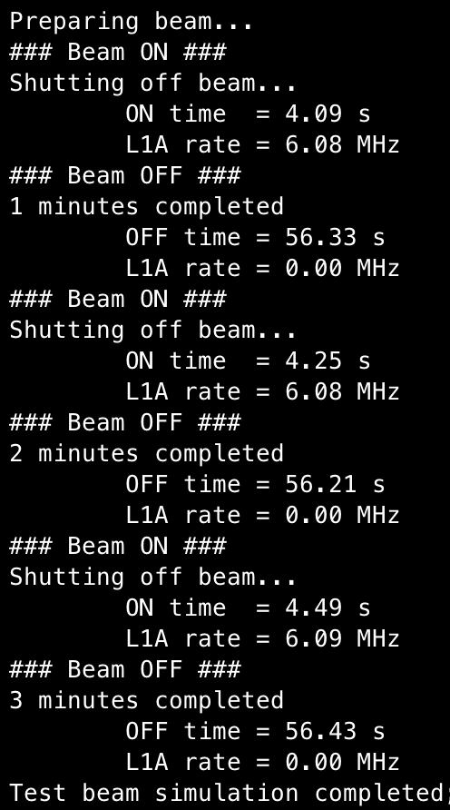

# Fermilab test beam simulation

To use the Fermilab test beam simulation, we rely on the `Beam.py` class and the `beam_utils.py` auxiliary functions. A simple script `test_beam.py` is available for quick testing. In addition to the simulation, the Beam class implements a UI monitoring dashboard for real-time checks of useful RB parameters. To use `test_beam.py`, pass the appropriate options:
```
Usage:
        test_beam
       Options:
        [--kcu KCU]              Specify the IP address of KCU. Default: 192.168.0.11
        [--host HOST]		 Specify host for control hub. Default: localhost
        [--l1a_rate L1A_RATE]    Level-1 Accept rate in kHz. Default: 1000
        [--time TIME]            Time in minutes that the beam will run. Default: 1
        [--verbosity]            Verbosity information
        [--dashboard]            UI Monitoring dashboard on?
        [--configuration]        Specify the readout board config file from "default, emulator, modulev0". Default: default
```
`test_beam.py` will simulate Fermilab's test beam of 4s on-time and 56s off-time spills, at the specified L1A rate and number of spills. The simulation will produce a compressed zip file after each spill and save it in the `outputs` directory with a time stamp. The dashboard currently monitors the number of cycles (i.e. spills), L1A rate count, FIFO occupancy, thermistor temperatures (RT1, RT2, SCA and VTRX), lost FIFO words and packet rate. The dashboard heavily relies on the [Rich Python library](https://github.com/Textualize/rich); for development of the dashboard see [docs](https://rich.readthedocs.io/en/stable/introduction.html).

## Test beam output



## UI monitoring dashboard output


